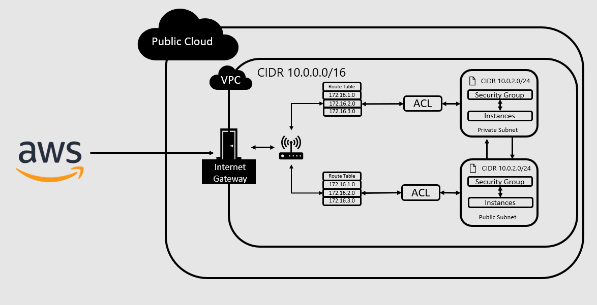

# Amazon Simple Storage Service (S3)


# Table of Contents
- [Amazon Simple Storage Service (S3)](#amazon-simple-storage-service-s3)
- [Table of Contents](#table-of-contents)
  - [What is Amazon S3](#what-is-amazon-s3)
  - [Why use Amazon S3](#why-use-amazon-s3)
  - [Accessing Amazon S3](#accessing-amazon-s3)
  - [Buckets on Amazon S3](#buckets-on-amazon-s3)
  - [Using boto3 For Amazon S3](#using-boto3-for-amazon-s3)
  - [What is AutoScaling & Load Balancing](#what-is-autoscaling--load-balancing)
  - [Making A Template](#making-a-template)
  - [Creating An Auto Scaling Group With Load Balancer](#creating-an-auto-scaling-group-with-load-balancer)
    - [Blocker Faced During Creating An Auto Scaling Group](#blocker-faced-during-creating-an-auto-scaling-group)
  - [Amazon Web Service Networking](#amazon-web-service-networking)

## What is Amazon S3
Amazon S3 is a storage service offered by amazon which allows storage of any format. The service offers:
- Scalability
- Data availability
- Security  

[Back](#table-of-contents)

## Why use Amazon S3
Amazon S3 can be used:
- To access databases on AWS
- To allow data to be globally available
- To store any format of data
- To backup data on more than one server
 
[Back](#table-of-contents) 

Amazon S3 can also be used as a disaster recovery plan.

## Accessing Amazon S3
- Enter the EC2 Instance **LINK**
- Amazon S3 uses python3 however ubuntu by default uses 2.7 so first we must enter these commands to get python 3 working in our instance so we must enter these commands:
  - `sudo apt install python3-pip`
  - `sudo apt install python3.7-minimal`
  - `alias python=python3.7`
  - `sudo pip3 install awscli`
  - `aws configure`
    - access key: **KEY**
    - secret access key: **KEY**
    - region name: `eu-west-1`
    - output format: `json`
  - `aws s3 ls` it should show you the files you have on the service if everything is done correctly  

[Back](#table-of-contents)


## Buckets on Amazon S3
- Making a bucket
  - `aws s3 mb s3://eng103a-armaan-devops`
    - "eng103a-armaan-devops" is the name of the folder I want to create.
    - S3 does not allow "_" or capital letters
- Removing a bucket 
  - `aws s3 rb s3://eng103a-armaan-devops`
    - there must be nothing in the bucket in order to delete the bucket
- Copying data from ec2 to a bucket:
  - `aws s3 cp test.txt s3://eng103a-armaan-devops`
- Copying data from a bucket to ec2:
  - `aws s3 cp s3://eng103a-armaan-devops/test.txt ~`

[Back](#table-of-contents)

## Using boto3 For Amazon S3
- First boto3 would have to be install for this pip and python must also be installed:
  - `sudo apt install python3`
  - `sudo apt install pip3`
  - check the version by `pip --version`
  - `pip3 install boto3`
- once this is done you can make a file called s3.py and in this file you must import boto3 in order to :
```
#!/usr/bin/env python
import boto3
bucket_name = "eng103a-armaan-devops"
location = {'LocationConstraint': "eu-west-1"}
s3 = boto3.resource('s3')
bucket_name = input("S3 Bucket Name\n")

while True:
    action = input("Type:[mb] Make a bucket, [rb] Remove a bucket, [d] Delete a file, [u] Upload a file, [dl] Download a file, [e] Exit Script\n")

    if action == "rb":
        s3.Bucket(bucket_name).delete()
    elif action == "mb":
        s3.create_bucket(Bucket=bucket_name, CreateBucketConfiguration=location)
    elif action == "d":
        filename = input("what is the filename?\n")
        s3.Object(bucket_name, filename).delete()
    elif action == "u":
        filename = input("what is the name of the file you're uploading?\n")
        targetfilename = input("what is the destination file name?\n")
        s3.Bucket(bucket_name).upload_file(filename, targetfilename)
    elif action == "dl":
        filename = input("what is the name of the file you're downloading?\n")
        targetfilename = input("what is the destination file name?\n")
        s3.Bucket(bucket_name).download_file(filename, targetfilename)
    elif action == "e":
        break
    else:
        print(\n"Please enter from the following optioins please")

Inspired by Zilamo
```
- You can then run this script by typing `python3 s3.py` in the ec2 instance and make a bucket or remove etc.

[Back](#table-of-contents)

## What is AutoScaling & Load Balancing
- Auto scaling is when the computational resources adjust automatically based on the server load.
  - If the server load is high it will start more servers to handle the load
  - Once the server load returns back to normal it will shut down the extra servers making this very cost effective
  - Example of this is a clothing website. This website may receive more traffic during the christmas period and because of this it will auto scale and run more servers, after the christmas period is over they will not want to run all of these servers as it is not cost effective so auto scale will then close servers down according to the traffic.
- Load Balancing distributes traffic so that it does not go to only one ec2 so it does not get overwhelmed.
  - The load balance will distribute the traffic between the availability zones that are running.
- Diagram to explain load balancing:


[Back](#table-of-contents)

## Making A Template
- Under "Instances" click "Launch Templates"
- Click "create launch template"
- Enter a template name such as "eng103a-armaan-asg"
- Tick "Provide guidance"
- Under "Applications and OS Images"
  - Click "My AMIs"
  - Search for the desired AMI
- Under "Instance Type"
  - Select t2.micro
- Under "Key Pair"
  - Select the correct key pair for example "eng103a"
- Under "Network Settings"
  - Select existing security group
  - choose the one that you use when running the AMI

[Back](#table-of-contents)

## Creating An Auto Scaling Group With Load Balancer
- Under "Auto Scaling" click "Auto Scaling Groups"
- Click "create an Auto Scaling group"
- Enter auto scaling group name such as "eng103a-armaan-asg-app"
- Then select the template you have just created using the steps above
- Select the availability zones you would like to use such as "eu-west-1a", "eu-west-1b", "eu-west-1c"
- After this you will have an option to use a load balancer by either attaching an existing load balancer or attaching a new one. In this case we want to attack a new load balancer
- Select "Application Load Balancer" as we are using HTTP
- Name the load balancer such as eng103a-armaan-asg-lb **Remember Do Not Use "_"s As It Will Give You An Error**
- You then want to select "Internet-Facing"
- After this create a target group under "Listeners and routing" and name it such as "eng103a-armaan-lb-lg"
- Tick the ELB box under "Health Checks" and tick the box under "Additional Settings"
- Select the "Desired Capacity", "Minimum Capacity", "Maximum Capacity" For Example 2,2,3
- Select "Target Tracking Scaling Policy"
  - Enter a suitable name 
  - Choose the metric type as well as the target value For example "Average CPU utilization" and "25"  for the target value
- Then you can add notifications and tags however it is not needed
- Finally "Create Auto Scaling Group"

### Blocker Faced During Creating An Auto Scaling Group
- Within the user data I was not using the absolute path which did was giving me an eginx error when trying to use the ip address to see if the application was running. This was fixed by using the full path for example "/home/ubuntu/eng103a/app"

[Back](#table-of-contents)

## Amazon Web Service Networking
- VPC Virtual Private Cloud
  - Is a secure and isolated private cloud that is within a public cloud. An example would be a crowded restraunt. Although there is people waiting for a table, the table that is reserved will not be given as it has been reserved for someone already.
- CIDR Block
  - Classless Inter-Domain Routing(CIDR) block is a way for allocating IP addresses & routing. You will need to specify an IP range when creating a network or route table for example "0.0.0.0" means that it will match to any IP address
- Internet Gateway
  - Internet gateway is a highly available VPC component that allows communication between the internet and your VPC. (IPv4, IPv6)
- Route Table
  - Contains a set of rules which are refered to as routes that determine what subnet or gateway to direct your traffic. Allows network packets to know where they need to go.
- Subnets
  - Is a range of IP addresses in your virtual private cloud. When creating a subnet you specify the IPv4 CIDR block which is a subset of the VPC CIDR block
- NACLs Network Access Control List (ACL)
  - Is an optional layer of security for your VPC that acts as a firewall for traffic coming in and out of your subnets



[Back](#table-of-contents)